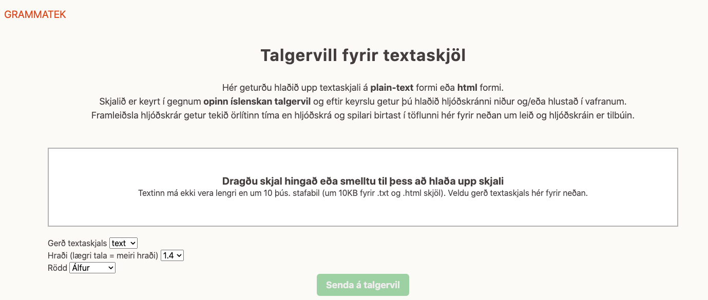

# Skjalalestur - Icelandic TTS for Documents 

**Skjalalestur** is a Ruby on Rails application for Icelandic Text-to-Speech. It produces audio files with generated 
speech from uploaded documents.
The application allows the user to download .mp3 audio files and/or to play the audio directly in the browser.

## Prerequisites

Ruby 3.0 or later

Rails 7.0.3. or later

Access to a REST-ful TTS-web service

Access to a storage service like Amazon S3, Google GCS, AzureStorage or similar.

## Setup

If you have Ruby and Rails installed, you can have a look at how the application looks like without having a connection 
to a TTS-service or a storage servie:

```
$ git clone git@github.com:grammatek/tts_webapp.git
$ cd tts_webapp
$ bin/rails db:migrate
$ bin/rails server
```

Now you should see the application under localhost:3000: `http://127.0.0.1:3000/`



To use the application, you need to hava access to the above mentioned services. 
Add your TTS-service URL in [tts_service.rb](https://github.com/grammatek/tts_webapp/blob/master/app/services/tts_service.rb)
`@@tts_url = <your/tts/service/url>`

On how to create and add Amazon S3 access, see e.g. https://www.honeybadger.io/blog/rails-app-aws-s3/, and on how to manage
and secure Amazon Access Keys in a Rails App: https://medium.com/swlh/securing-keys-in-a-rails-app-bfa9a6394ca4


## Contributing

You can contribute to this project by forking it, creating a branch and opening a new
[pull request](https://github.com/grammatek/simaromur/pulls).

## License

This software is licensed under the [Apache License](LICENSE), Copyright © 2022 Grammatek ehf

This software is developed under the auspices of the Icelandic Government 5-Year Language Technology Program, described
[here](https://www.stjornarradid.is/lisalib/getfile.aspx?itemid=56f6368e-54f0-11e7-941a-005056bc530c) and
[here](https://clarin.is/media/uploads/mlt-en.pdf) (English).
